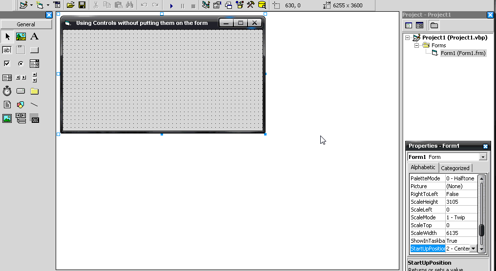



## Create Controls at runetime \(only 3 lines of code\!\)

### Description

This code will show you how to create controls at runtime using only 3 lines of code!
 
### More Info
 

             |
---                |---
**Submitted On**   |2007-04-25 04:50:02
**By**             |[Webmonster](https://github.com/Planet-Source-Code/PSCIndex/blob/master/ByAuthor/webmonster.md)
**Level**          |Beginner
**User Rating**    |4.3 (17 globes from 4 users)
**Compatibility**  |VB 6\.0
**Category**       |[Complete Applications](https://github.com/Planet-Source-Code/PSCIndex/blob/master/ByCategory/complete-applications__1-27.md)
**World**          |[Visual Basic](https://github.com/Planet-Source-Code/PSCIndex/blob/master/ByWorld/visual-basic.md)
**Archive File**   |[Create\_Con2062214252007\.zip](https://github.com/Planet-Source-Code/webmonster-create-controls-at-runetime-only-3-lines-of-code__1-68446/archive/master.zip)

